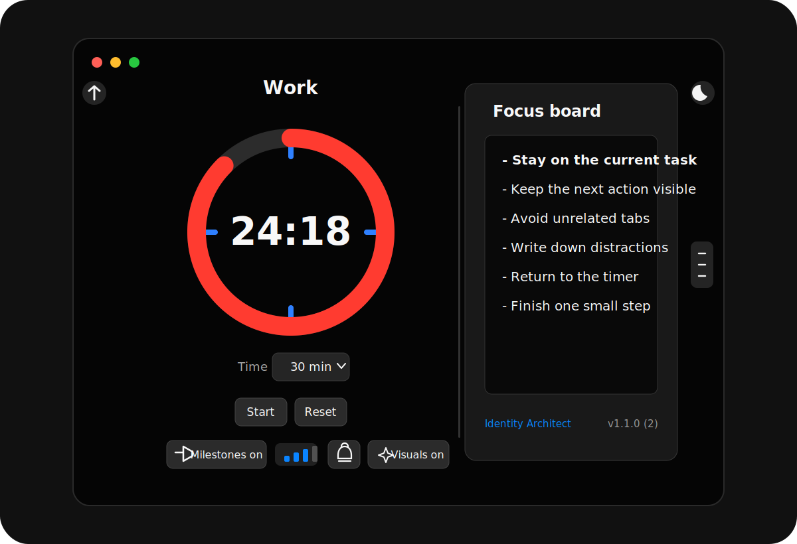

# SprintFocusTimer

A small macOS focus timer with visible progress, milestone reminders, optional always-on-top behavior, and light/dark display modes.



## What It Does

SprintFocusTimer is built for short, visible work sessions. Pick a duration, start the timer, and keep it on screen as a visual reminder.

Features:

- Preset timers: 1, 5, 10, 15, 30, 60, and 90 minutes
- Resizable circular countdown timer
- Optional milestone markers at quarter intervals
- Optional milestone tick sounds with quick volume preview
- Optional completion alarm
- Optional visual attention glow for milestones and completion
- Light/dark background toggle
- Optional always-on-top window
- Settings persist between app launches

## Download

Packaged downloads belong on the GitHub Releases page:

https://github.com/DaneShakespear/SprintFocusTimer/releases

Download `SprintFocusTimer.dmg`, open it, then drag `SprintFocusTimer.app` into Applications.

## Opening The App On macOS

SprintFocusTimer is currently unsigned and unnotarized. macOS may block it the first time you open it.

To open it:

1. Open Applications.
2. Right-click `SprintFocusTimer.app`.
3. Choose `Open`.
4. If macOS shows a warning, choose `Open` again.

If macOS still blocks it:

1. Open System Settings.
2. Go to Privacy & Security.
3. Look for the message about SprintFocusTimer being blocked.
4. Click `Open Anyway`.

The source code is public so you can inspect how the app is made or build it yourself.

## Build From Source

Requirements:

- macOS
- Xcode

Build and run:

1. Clone the repo.
2. Open `SprintFocusTimer.xcodeproj` in Xcode.
3. Choose the `SprintFocusTimer` scheme.
4. Press Run.

You can also build from Terminal:

```bash
xcodebuild \
  -project SprintFocusTimer.xcodeproj \
  -scheme SprintFocusTimer \
  -configuration Release \
  -destination 'platform=macOS' \
  build
```

## Create A DMG

The repo includes a helper script:

```bash
./scripts/create_dmg.sh
```

It builds a Release app and creates:

```text
dist/SprintFocusTimer.dmg
```

The DMG includes:

- `SprintFocusTimer.app`
- Applications shortcut
- Install instructions

## Notes On Signing

The app can be distributed as an unsigned DMG, but users may need to approve it manually in macOS.

For a smoother public install experience, the app should eventually be signed with an Apple Developer ID and notarized by Apple.

## License

MIT License. See [LICENSE](LICENSE).
